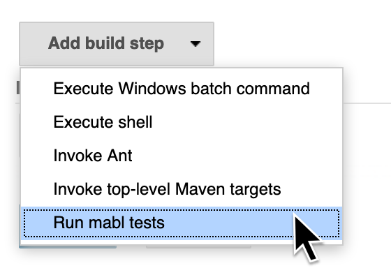
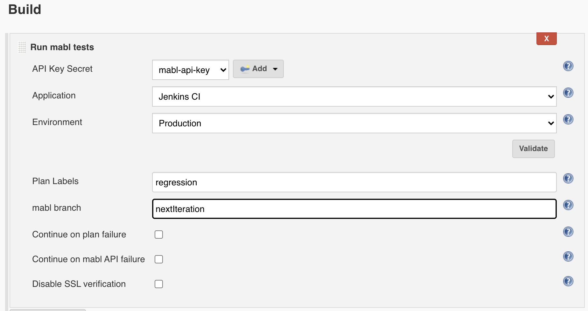

# mabl Jenkins Plugin
[](https://ci.jenkins.io/job/Plugins/job/mabl-integration-plugin/job/master/) [](https://github.com/jenkinsci/mabl-integration-plugin/blob/master/LICENSE) [](https://twitter.com/mablhq)

This plugin allows easy launching of [mabl](https://www.mabl.com) tests as a step in your Jenkins build. Your Jenkins build outcome will be tied to that of your deployment event.

  * [Plugin Installation](#plugin-installation)
  * [Features](#features)
  * [Requirements](#requirements)
  * [Adding a mabl project step](#adding-a-mabl-project-step)
  * [Adding a mabl pipeline step](#adding-a-mabl-pipeline-step)
  * [Environment variable collection](#environment-variable-collection)
  * [Change log](#change-log)
  * [Building from source](#building-from-source)
  * [Local development](#local-development)
      * [Jenkins docker](#jenkins-docker)
      * [Local machine](#local-machine)
  * [Deployment](#deployment)

## Plugin Installation
Install the [plugin](https://plugins.jenkins.io/mabl-integration) into your Jenkins `v1.580+` server from the *Available Plugins* tab by searching for "mabl".

### Features

-   Launch mabl tests as a project step
-   Fail your Jenkins build if the mabl tests fail
    -   Optionally continue on failure

### Requirements

-   Minimum Jenkins version *1.580.1*
-   mabl API key
    -   See [integration
        docs](https://help.mabl.com/v1.0/docs/integrating-mabl-with-your-cicd-workflow#section-the-mabl-deployment-events-api)
        for details  
          

### Adding a mabl Project Step

Add a *Run mabl tests* step to your new or existing project.



*Configure the API key*. Then select environment, and application from the
drop-down. At least one of environment and application must be
supplied.  All matching plans and their tests will be run during this
step. The step will block until the tests are complete/failed, or one
hour has elapsed.


The *Advanced...* button opens up additional options:

-   Filter by plan labels to run only plans tagged with the selected
    labels. (You can select multiple labels using shift/ctrl click.)


-   Continue execution if your plan/tests fail
-   Continue execution if there is an unexpected error in the mabl API
-   Disable SSL verification



### Adding a mabl Pipeline Step

In a pipeline step, select 'Configure'. In the pipeline script, insert a
pipeline step for mabl. This can be written by hand or created via the
'Pipeline Syntax' tool. Here is an example output:

-   mabl: The pipeline function to be called. - Required
-   applicationId: Selects the application to run deployments
    against (one of environmentId or applicationId is required)
-   continueOnMablError: Continue if there is an unexpected error in the
    mabl API
-   continueOnPlanFailure: Continue if your plan/tests fail
-   environmentId: Selects the environment to run deployments against
    (one of environmentId or applicationId is required)
-   restApiKey: The apiKey of the desired deployment workspace -
    Required  
      

**Pipeline Step Setup**

``` syntaxhighlighter-pre
mabl applicationId: 'APP-ID-a', continueOnMablError: true, continueOnPlanFailure: true, environmentId: 'ENV-ID-e', restApiKey: 'REST-API-KEY'
```

OR something like this:

**Pipeline Step Setup**

``` syntaxhighlighter-pre
node {
   stage('mabl') {
       node {
           step([$class: 'MablStepBuilder', restApiKey: 'REST-API-KEY', environmentId: 'ENV-ID-e', applicationId: 'APP-ID-a'])
       }
   }
}
```

###  Environment Variable Collection

The mabl plugin will optionally collect build and repository information
to send along with mabl deployments. This will give more information and
insights into testing environment state for test runs. We will not
collect sensitive information such as passwords or API keys.

To enable this feature:

-   Go to the 'Manage Jenkins' page from the 'Dashboard'
-   Go to the 'Configure System' page
-   Find the 'mabl' section and check the 'Send build environment
    variables to mabl' checkbox


Now you will see the environment and build information collected in the
output log of future runs that use a mabl plugin step.

**Example Variable Collections**

``` syntaxhighlighter-pre
Send build environment variables is set. Collecting the following information:
  'GIT_BRANCH' => 'origin/master'
  'GIT_COMMIT' => 'a246e0c756791965bdb6fc9caa1a36775422fcec'
  'GIT_URL' => 'git@github.com:example/my_repository.git'
  'GIT_PREVIOUS_COMMIT' => 'a246e0c73a691935bdb6fc9caa1a36775422fce5'
  'JOB_NAME' => 'mabl integration'
  'BUILD_NUMBER' => '47'
  'RUN_DISPLAY_URL' => 'http://127.0.0.1:9090/job/mabl%20integration/47/display/redirect'
```

### Change Log

#### v0.0.18 (4 February 2020)
-   Screenshot and documentation updates
-   Updates to dependencies

#### v0.0.17 (29 January 2020)
-   API key is now encrypted in configuration file
-   Updated messages to replace journey with test


#### v0.0.16 (04 October 2019)

-   Fix bug when displaying status for multi-stage plans.

#### v0.0.15 (05 September 2019)

-   The output of failed run with link is now available

#### v0.0.13 (30 July 2019)

-   Support for plan label filtering in the mabl build step

#### v0.0.10 (08 June 2018)

-   The mabl plugin is now available to use a pipeline step
-   Optionally allow mabl to collect environment information to enhance
    deployment journey insights

#### v0.0.9 (08 June 2018)

-   The output of mabl tests are now available as junit XML in the
    workspace directory for reports and download  

#### v0.0.8 (18 May 2018)

-   Environment and Application drop downs automatically populated from
    API key

#### v0.0.7 (17 May 2018)

-   More resilient to failures

#### v0.0.6 (18 April 2018)

-   Advanced form validation support added

#### v0.0.5 (13 April 2018)

-   Support for Windows console output and encodings

#### v0.0.4 (12 April 2018)

-   Initial release

## Building from Source

1. Clone this repo
2. build with `mvn clean package`
3. Copy the plugin in `target/mabl-integration.hpi` to your Jenkins `plugins/` directory
4. Restart Jenkins

You can also install the `.hpi` file from the web UI by visting
**Jenkins > Manage Jenkins > Manager Plugins > Advanced > Upload Plugin**.

## Local Development
### Jenkins Docker
Overview of how to launch a Jenkins Docker instance with Jenkins, then build the plugin and deploy it that instance.

*Note:* Please check [Jenkins Hub](https://hub.docker.com/r/jenkins/jenkins)
for any specific image version before pulling Jenkins image.

```bash
# Launch Jenkins container and automatically pull the image if not present
docker run -d -p 9090:8080 --name=jenkins-master jenkins/jenkins

# Run command in the running container
docker exec -it jenkins-master bash

# Find initialAdminPassword to unlock Jenkins on a browser at localhost:9090
cat /var/jenkins_home/secrets/initialAdminPassword

# Setup your Jenkins instance

# Build and deploy plugin to Jenkins (make sure you're in the mabl-integration-plugin directory)
mvn clean package \
  && docker cp target/mabl-integration.hpi jenkins-master:/var/jenkins_home/ \
  && docker restart jenkins-master
```

### Local Machine
Overview of how to run/debug plugin with Intellij on local machine.

- Open the project in Intellij
- Look for Edit Configurations under Run
- Add Maven template
- Configure your working directory to point to your project path similarly as
the screenshot below:

- Click OK and then run/debug the plugin
- Wait until you see

        INFO: Jenkins is fully up and running

- Log into this URL on your web browser

        localhost:8090/jenkins
Now you can test your plugin.

## Deployment

Before making a new plugin release, ensure code is in high quality, fully tested state. See [extra checks](https://wiki.jenkins.io/display/JENKINS/Plugin+Release+Tips).

1. Update your `~/.m2/settings.xml` according to the [Jenkins docs](https://wiki.jenkins.io/display/JENKINS/Hosting+Plugins#HostingPlugins-Releasingtojenkins-ci.org).
2. Setup and run a GitHub [ssh agent](https://help.github.com/articles/generating-a-new-ssh-key-and-adding-it-to-the-ssh-agent/#adding-your-ssh-key-to-the-ssh-agent).
3. Run `mvn release:prepare release:perform -B` from the HEAD of master
4. Run `mvn deploy` on success of above step.

Wait ~8 hours for plugin to become GA across all Jenkins instances under the "Available Plugins" listing.
